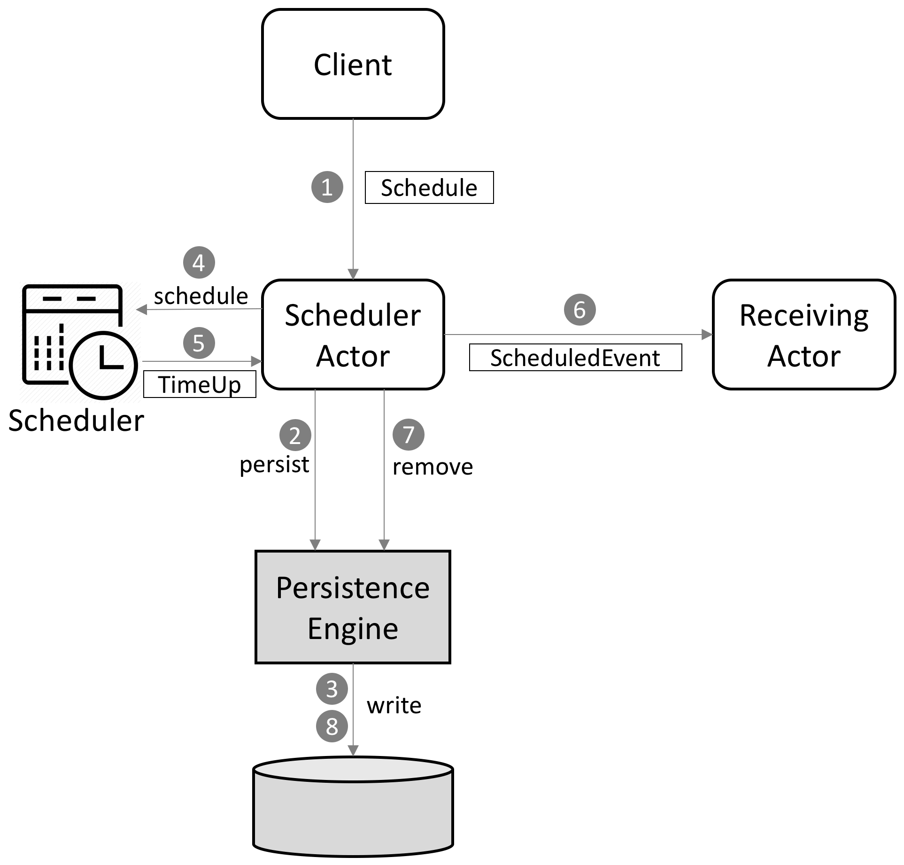
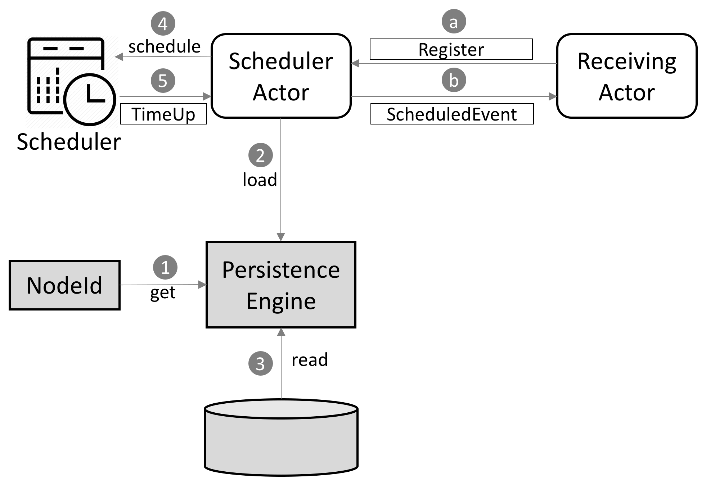
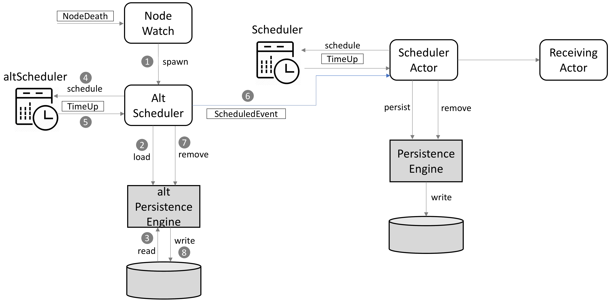
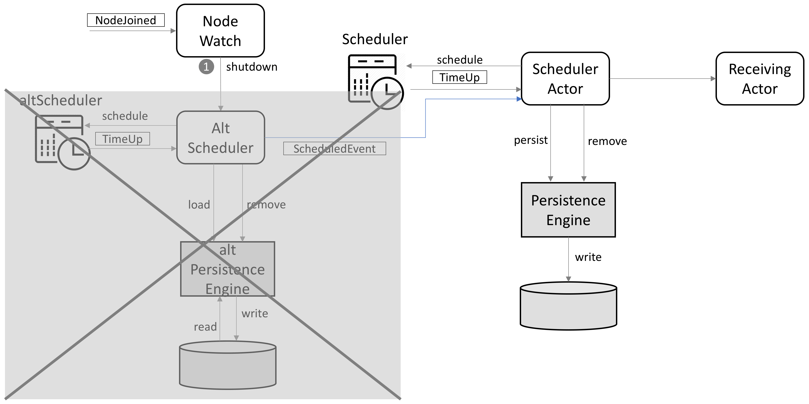
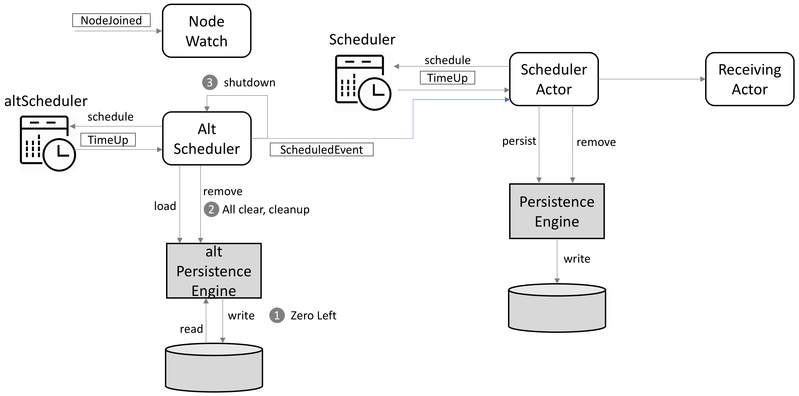
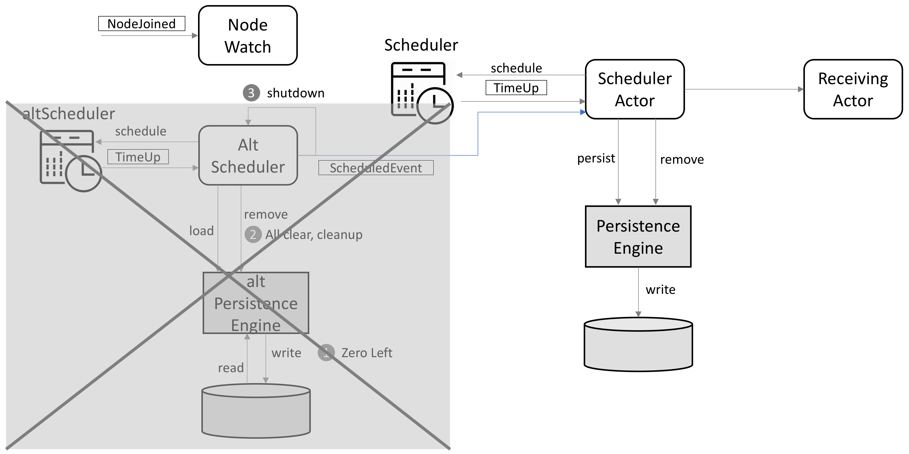

# Persistent Scheduler

## Purpose
The Akka scheduler is a very powerful, high performance, and highly scalable scheduler. However, it supports less of long term scheduling. If the process running the scheduler dies or shuts down, all pending messages or tasks are lost.

The squbs Persistent Scheduler is designed to retain the performance and scalability characteristics from Akka by re-using the Akka scheduler. However, it is designed to persist the scheduled messages and remove them after the messages are delivered. In case of a process down and scale down of the systems to reduce the load, messages will be recovered and delivered on a different system.

## Requirements
* Keep message scheduling and delivery local unless the local system ceases to exist.
* Persist to any key-value store, with clear abstractions from the storage engine.
* Cleanly handles system shutdown, restarts, and reprovisions.
* Cleanly handles system scale down.
* Minimize I/O in normal situations with zero reads

## Design

### Persistent Manager

#### Normal Operations
The persistent scheduler infrastructure composes of the `Scheduler`, the `SchedulerActor` and the `PersistenceEngine`. The `Scheduler` is the common Akka actor scheduler. The `PersistenceEngine` maps the scheduled events to persistent store and retrieves the stored scheduled events when needed. The `SchedulerActor` is the center of the interaction. Any client that wants to schedule an event sends a `Schedule` request message to the `SchedulerActor` which will persist the request and invoke the `Scheduler` to schedule the event. At arrival of scheduled time, a `TimeUp` message is sent to the `SchedulerActor` which will then send a corresponding `ScheduledEvent` to the receiving actor.

*Figure 1: Sequence for normal operations of Persistent Scheduler*

The receiving actor has to register itself by name in order to receive events. This is due to the `ActorRef`s non-persistent nature all scheduled events can only be sent to a registered name. In case the receiving actor has not yet registered, the event will be scheduled for delayed delivery in another 5 seconds (configurable).

#### Bootstrapping and Restoring
At startup time, the `SchedulerActor` invokes the `PersistenceEngine` to load the undelivered events. These events will be scheduled onto the scheduler and delivered to the receiving actor soon after it registers to receive the scheduled events.

The `NodeId` is a pluggable provider of node identifiers. These may vary based on cluster deployment architecture. For instance, a simple `NodeId` may just query the system's name or primary IP address and use it as the idenfier. This is needed to keep the persistence store for each scheduler actor separate.

*Figure 2: Sequence for bootstrapping the Persistent Schduler*

#### Backing up Another Node
As each node has their own persistent scheduler and persistent store, we need to worry about node failures, restarts, and flex down scenarios. In case of a node failure, another node will need to handle the scheduling temporarily. This assumes that the scheduled event can run symmetrically on any other node and the per-node scheduler is only to maximize scalability. The `NodeWatch` actor assumes the role of finding out whether it has to start the stand-in. When it finds out out it has to stand-in for another node, either for temporarily (node failure/restarts) or permanent (flex-down) replacements, it will start an `AltScheduler` actor that controls the backup environment. This `AltScheduler` actor also has its own `PersistenceEngine` that reads and updates the persistent store, standing in for the backed up node. There are no new events scheduled for the `AltScheduler` actor. New events are only scheduled on the original node.

*Figure 3: Backup infrastructure bring-up sequence*

#### Backed Up Node Resumes
Once the downed node comes back or an assignment change happened, the `NodeWatch` will also be notified. `NodeWatch` will then send a `Shutdown` message to the `AltScheduler` actor which will then shut down its scheduler and delete all scheduled events on this scheduler. The original node then resumes its responsibility for delivering the rest of the scheduled events.

Note: In the transition period, an event must not be lost. However, it may be delivered more than once.

*Figure 4: Sequence for ending backing up for another node*

#### Depleting Scheduled Events
If the node does not come back up due to permanent node removal, flex-down, etc. and the scheduled events are depleted as indicated by the `PersistenceManager`, all records and metadata about this node will be removed and cleaned up. This node will no longer be known to the cluster. The `AltScheduler` actor will then shut itself and all it's infrastructure down.

*Figure 5: Sequence for detecting depletion and cleanup*

*Figure 6: Sequence for shutdown after cleanup*

### Backup Nodes Assignments

#### Ensuring a single node gets the job to manage
1. Right after startup, on a key-value store, use key `${clusterName}_bkupmgr` to read whether there is a node registered. If so, try again in 120 seconds.
2. If not found, use CAS to register your IP address as the value. Set the TTL for this record to 90 seconds.
3. Now this node is the "Backup assignment manager."
4. Set a scheduler to do a check-and-refresh every 60 seconds.
5. On a check-and-refresh, check that this node is still the value and if so, re-write the value to extend the TTL another 120 seconds each time.
6. If scheduler is firing late or not firing for any reason, other nodes will have grabbed this role. In that case, shutdown the "Backup assignment manager". It would have been started by another node already.

#### Node registration
1. At startup time, each node will register itself to `${clusterName}_nodes`. This is a JSON document that holds all the node names. Use CAS to read the document and add the current node to the document if not already exists.
2. Write the current timestamp to `${clusterName}_${nodeId}` with a TTL of 90 seconds.
3. Set scheduler to come back and update the lease on `${clusterName}_${nodeId}` with the same value to extend the lease every 60 seconds.

#### The Backup Assignment Manager
1. The backup assignment manager reads `${clusterName}_nodes`. Then for each node, it reads `${clusterName}_${nodeId}` and checks the timestamp. If key is not available or timestamp is beyond 90 minutes before current time, this node is considered inactive. Clock skew of up to 15 seconds is safe in this model.
2. Deletion of inactive nodes happens after all the node-specific state is processed. This is discussed separately, below.
3. We should now have a list of all nodes currently in the cluster, and all active nodes.
4. Randomly assign each node in the cluster with an active backup node. The backup node will have a backup role for this node. Make sure the assignment is evenly distributed. Most backups should have one assignment. No backup should have more than two assignments.
5. Write the node and backup node to a document with key `${clusterName}_backups`.
6. Every 60 seconds, re-read all nodes and the active nodes, and the current assignment document from `${clusterName}_backups`. Inspect the active nodes and re-balance the backups. Minimize the assignment change.

#### The NodeWatch Actor
The `NodeWatch` actor runs on any node and has the job of monitoring the `${clusterName}_backups` key to determine what other nodes this node has to stand-in for. Then, it will read the `${clusterName}_${nodeId}` key and check the timestamp whether the node to be backed-up is still alive. For each node that is not alive, spawn an `AltScheduler` actor to take care of pending state for that node. The `AltScheduler` actor will create a backup infrastructure to deal with the activities left over from the dead node.

The `NodeWatch` actor keeps monitoring both the `${clusterName}_backups` and the `${clusterName}_${nodeId}` every 60 seconds for any changes in the node assignment and liveness. If the `AltScheduler` is started and this node no longer needs a backup infrastructure, the `NodeWatch` will shut down the backup infrastructure. If there is a change, the `NodeWatch` also starts the backup infrastructure as needed. The backup infrastructure will clean up the node from all cluster documents when there is no more state to be processed for given node. It will then shut itself down.

### Monitoring

Monitoring is very important for this backup environment. We need to ensure any state transition can be seen via JMX as follows:
1. Backup assignments, active nodes, inactive nodes, and backups executing at any point in time.
2. Total scheduled events, pending events, and delivered events.

